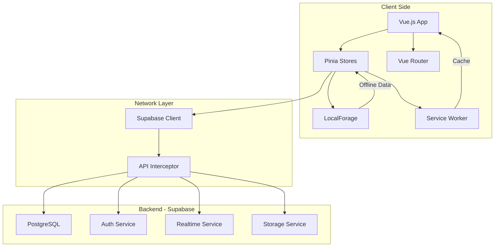
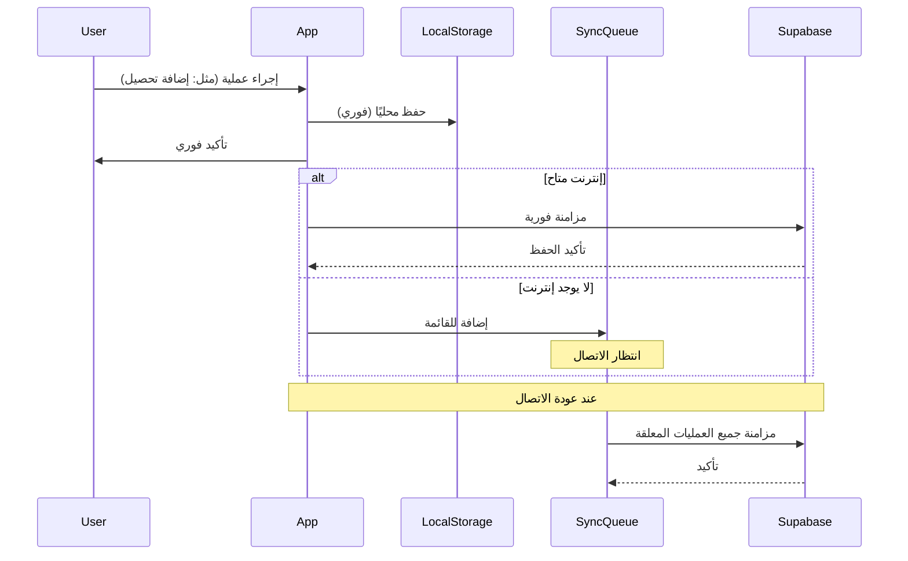
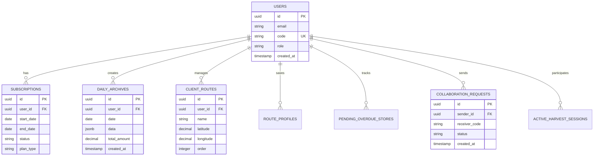

# CollectPro - نظام إدارة التحصيلات الاحترافي

<p align="center">
  
</p>

<p align="center">
  <strong>تطبيق ويب تقدمي (PWA) مصمم ليكون الحل الشامل والآمن لإدارة عمليات التحصيل المالي اليومية وتخطيط مسارات العملاء.</strong>
</p>

<p align="center">
  
  
  
  
  
  
</p>

---

## 📋 جدول المحتويات

- [نظرة عامة](#-نظرة-عامة)
- [المميزات الرئيسية](#-المميزات-الرئيسية)
- [التقنيات المستخدمة](#️-التقنيات-المستخدمة)
- [المعمارية وأنماط التصميم](#-المعمارية-وأنماط-التصميم)
- [هيكل المشروع](#-هيكل-المشروع)
- [مخطط قاعدة البيانات](#️-مخطط-قاعدة-البيانات)
- [خطوات البدء والتشغيل](#-خطوات-البدء-والتشغيل)
- [الأوامر المتاحة](#-الأوامر-المتاحة)
- [الأمان](#-الأمان)
- [النشر والإنتاج](#-النشر-والإنتاج)
- [الأداء والتحسينات](#️-الأداء-والتحسينات)
- [استكشاف الأخطاء](#-استكشاف-الأخطاء)
- [الأسئلة الشائعة](#-الأسئلة-الشائعة)
- [المساهمة](#-المساهمة)
- [الترخيص](#-الترخيص)

---

## 🌟 نظرة عامة

**CollectPro** هو تطبيق ويب تقدمي (PWA) متطور مصمم خصيصًا لإدارة عمليات التحصيل المالي بكفاءة عالية. يجمع التطبيق بين القوة والبساطة، مما يجعله الحل المثالي لمحصلي الديون والمديرين الماليين.

### لماذا CollectPro؟

- 📱 **PWA متقدم**: يعمل على أي جهاز (كمبيوتر، هاتف، تابلت) مع إمكانية التثبيت
- 🔄 **Offline-First**: العمل الكامل بدون إنترنت مع مزامنة تلقائية
- 🚀 **أداء عالي**: استجابة فورية مع تحميل سريع
- 🎨 **واجهة مستخدم حديثة**: تصميم عصري مع دعم الوضع الليلي
- 🔐 **أمان متقدم**: Row Level Security مع مصادقة آمنة
- 📊 **تقارير تفصيلية**: رسوم بيانية وإحصائيات شاملة
- 👥 **تعاون في الوقت الفعلي**: مشاركة البيانات مع الزملاء

---

## ✨ المميزات الرئيسية

### 💼 إدارة الأعمال الأساسية

#### 💰 إدارة التحصيلات (`HarvestView`)
- واجهة سريعة وسهلة لتسجيل التحصيلات اليومية
- حسابات تلقائية للإجماليات وصافي الربح
- حساب حالة التصفير (الكاش المتبقي)
- إضافة وتعديل وحذف العملاء بسهولة
- حفظ تلقائي ومزامنة فورية مع السحابة
- دعم العمل الكامل بدون إنترنت

#### 🗺️ تخطيط خط السير (`ItineraryView`)
- إدارة وتخطيط مسارات العملاء على خريطة تفاعلية
- حفظ قوالب مسارات مخصصة (Route Profiles)
- ترتيب العملاء حسب المسار الأمثل
- تحديد المواقع الجغرافية للعملاء
- استيراد العملاء من ملفات Excel
- عرض المسار على خريطة Leaflet تفاعلية

#### 🗄️ أرشفة متقدمة (`ArchiveView`)
- نظام أرشفة قوي لحفظ بيانات كل يوم على حدة
- بحث فوري وفلترة متقدمة حسب:
  - التاريخ
  - اسم المحل
  - الكود
  - المبلغ
- عرض تفصيلي لكل يوم مع الإحصائيات
- تصدير الأرشيف كصور أو PDF
- حذف الأرشيفات القديمة

### 👥 التعاون والمشاركة

#### 🤝 المشاركة والتعاون (`ShareHarvestView`)
- **نظام الدعوات**: إرسال واستقبال دعوات المشاركة عبر كود مستخدم فريد
- **المشاهدة الحية**: متابعة جداول التحصيل الخاصة بالزملاء في الوقت الفعلي
- **Recently Viewed**: تتبع المستخدمين الذين تمت مشاهدة بياناتهم مؤخرًا
- **Real-time Updates**: تحديثات فورية عبر WebSockets
- **Archive Access**: الوصول لأرشيفات الزملاء المشاركين

#### 📥 المتاجر المتأخرة
- تتبع المتاجر المتأخرة إي السداد
- مشاركة قائمة المتأخرات عبر السحابة
- إضافة وحذف المتاجر المتأخرة
- عرض تفصيلي لكل محل متأخر

### 🛡️ الإدارة والاشتراكات

#### 📊 لوحة تحكم إدارية (`AdminView`)
- **Dashboard شامل**: إحصائيات كاملة عن النظام
  - إجمالي المستخدمين
  - الاشتراكات النشطة
  - معدل التجديد
  - إحصائيات الاستخدام اليومية
- **إدارة المستخدمين**:
  - عرض جميع المستخدمين مع التفاصيل
  - البحث والفلترة المتقدمة
  - الوصول لأرشيفات أي مستخدم
  - عرض حالة الاشتراك لكل مستخدم
- **Grouped Customer Locations**:
  - تجميع مواقع العملاء حسب المستخدم
  - عرض إحصائيات لكل مستخدم
  - تتبع آخر تحديث

#### 💳 نظام اشتراكات متكامل
- **صفحة اشتراكي** (`MySubscriptionView`): عرض تفاصيل الاشتراك الحالي
- **صفحة الاشتراكات** (`SubscriptionsView`): اختيار خطة الاشتراك المناسبة
- **صفحة الدفع** (`PaymentView`): معالجة الدفع بشكل آمن
- **حساب دقيق للأيام المتبقية**: نظام موحد يراعي فارق التوقيت بين السيرفر والعميل
- **تنبيهات الاشتراك**: تنبيهات تلقائية قبل انتهاء الاشتراك

### 📊 التقارير والتحليلات

#### 📈 صفحة التقارير (`ReportsView`)
- **إحصائيات شاملة**:
  - إجمالي التحصيل
  - متوسط التحصيل اليومي
  - عدد العملاء النشطين
  - صافي الربح
- **رسوم بيانية تفاعلية** (Chart.js):
  - تطور التحصيل على مدار الشهر
  - نسب التحصيل
  - مقارنة الأداء
- **قوائم تحليلية**:
  - أفضل 10 عملاء
  - العملاء المتعثرين
  - أعلى التحويلات
  - أقل التحويلات
- **تصدير التقارير**: تصدير التقارير كصور أو PDF

### 🔧 أدوات مساعدة

#### 🔢 عداد الأموال (`CounterView`)
- أداة مساعدة لحساب الفئات النقدية المختلفة
- دعم جميع الفئات (من 1 قرش إلى 200 جنيه)
- حساب تلقائي للإجمالي
- واجهة سريعة وسهلة الاستخدام
- حفظ واسترجاع الحسابات

#### 📤 تصدير البيانات
- تصدير الجداول كصور عالية الجودة (html2canvas)
- تصدير PDF احترافي (jsPDF)
- مشاركة البيانات عبر التطبيقات الأخرى

#### 🔐 مصادقة آمنة (`LoginView`)
- تسجيل دخول عبر البريد الإلكتروني
- تسجيل دخول عبر Google OAuth
- استعادة كلمة المرور
- إنشاء حسابات جديدة
- جلسات آمنة مع Supabase Auth

### 📱 تجربة مستخدم متقدمة

#### 🎨 تخصيص كامل
- **الوضع الليلي**: واجهة مريحة للعين مع دعم كامل للوضع الليلي
- **تخصيص الأعمدة**: إظهار أو إخفاء أعمدة الجداول
- **إعدادات قابلة للحفظ**: جميع التفضيلات محفوظة محليًا

#### ⚡ أداء وموثوقية
- **Service Worker متقدم**: تخزين مؤقت ذكي للموارد
- **Offline Storage**: LocalForage للتخزين المحلي القوي
- **Sync Queue**: قائمة انتظار للمزامنة عند العودة للإنترنت
- **Error Handling**: معالجة متقدمة للأخطاء مع Logger System
- **حماية من فقدان البيانات**: حفظ تلقائي قبل إغلاق الصفحة

---

## 🛠️ التقنيات المستخدمة

يعتمد المشروع على مجموعة من التقنيات الحديثة لضمان الأداء العالي والأمان:

### الواجهة الأمامية (Frontend)

| التقنية | الإصدار | الوصف |
|---------|---------|-------|
| **Vue.js** | v3.4.27 | إطار عمل JavaScript تفاعلي لبناء واجهات المستخدم |
| **Vite** | v5.3.1 | أدوات بناء سريعة مع Hot Module Replacement |
| **Pinia** | v2.1.7 | مكتبة إدارة الحالة الرسمية لـ Vue.js |
| **Vue Router** | v4.3.2 | التنقل والتوجيه بين الصفحات |

### الخلفية وقاعدة البيانات (Backend & Database)

| التقنية | الإصدار | الوصف |
|---------|---------|-------|
| **Supabase** | v2.43.4 | منصة متكاملة توفر PostgreSQL، Authentication، Storage، Realtime |
| **PostgreSQL** | - | قاعدة بيانات علائقية قوية وموثوقة |

### PWA والتخزين المحلي

| المكتبة | الإصدار | الوصف |
|---------|---------|-------|
| **vite-plugin-pwa** | v1.2.0 | تمكين قدرات PWA وتوليد Service Worker |
| **LocalForage** | v1.10.0 | تخزين محلي متقدم مع دعم IndexedDB |

### مكتبات UI/UX

| المكتبة | الإصدار | الوصف |
|---------|---------|-------|
| **SweetAlert2** | v11.11.0 | رسائل وتنبيهات تفاعلية جميلة |
| **Chart.js** | v4.5.1 | رسوم بيانية تفاعلية للتقارير |
| **vue-chartjs** | v5.3.3 | wrapper لـ Chart.js في Vue |
| **html2canvas** | v1.4.1 | تحويل عناصر HTML إلى صور |
| **jsPDF** | v3.0.4 | إنشاء ملفات PDF |
| **Leaflet** | v1.9.4 | خرائط تفاعلية |
| **vue-leaflet** | v0.10.1 | wrapper لـ Leaflet في Vue |
| **xlsx** | v0.18.5 | معالجة ملفات Excel |

### أدوات التطوير والجودة

| الأداة | الإصدار | الوصف |
|--------|---------|-------|
| **Vitest** | v1.6.0 | إطار اختبار سريع |
| **Vue Test Utils** | v2.4.6 | أدوات اختبار مكونات Vue |
| **ESLint** | v9.3.0 | فحص جودة الكود |
| **Prettier** | v3.2.5 | تنسيق الكود تلقائيًا |
| **JSDOM** | v24.1.0 | بيئة DOM للاختبار |

### أدوات إضافية

| المكتبة | الإصدار | الوصف |
|---------|---------|-------|
| **mitt** | v3.0.1 | Event emitter خفيف للتواصل بين المكونات |

---

## 🏗️ المعمارية وأنماط التصميم

### نمط المعمارية العامة



### State Management (Pinia)

نستخدم نمط **Pinia Stores** لإدارة الحالة بشكل منظم:

- **auth.js**: إدارة المصادقة والجلسات
- **harvest.js**: إدارة بيانات التحصيل اليومي
- **archiveStore.js**: إدارة الأرشيف
- **itineraryStore.js**: إدارة خطوط السير
- **adminStore.js**: إدارة لوحة التحكم
- **collaborationStore.js**: إدارة التعاون والمشاركة
- **reportsStore.js**: إدارة التقارير
- **settings.js**: إدارة الإعدادات
- **ui.js**: إدارة حالة واجهة المستخدم

### Offline-First Architecture



### أنماط التصميم المستخدمة

1. **Composition API Pattern**: استخدام Vue 3 Composition API لكتابة كود قابل لإعادة الاستخدام
2. **Repository Pattern**: فصل منطق الوصول للبيانات في Services
3. **Observer Pattern**: استخدام Pinia Reactivity و Realtime Subscriptions
4. **Singleton Pattern**: مثيل واحد لـ Supabase Client
5. **Factory Pattern**: إنشاء المكونات ديناميكيًا
6. **Module Pattern**: تنظيم الكود في وحدات منفصلة

---

## 📂 هيكل المشروع

```
CollectPro/
│
├── public/                     # الملفات الثابتة
│   ├── logo-momkn.png
│   ├── manifest.json
│   ├── favicon.ico
│   └── manifest/               # أيقونات PWA
│       ├── icon-48x48.png
│       ├── icon-192x192.png
│       └── icon-512x512.png
│
├── src/                        # الكود المصدري الرئيسي
│   ├── assets/                 # ملفات CSS والصور
│   │   ├── main.css           # الأنماط الأساسية
│   │   └── base.css           # متغيرات CSS
│   │
│   ├── components/             # مكونات Vue.js
│   │   ├── layout/            # مكونات التخطيط
│   │   │   ├── TheHeader.vue
│   │   │   ├── TheSidebar.vue
│   │   │   └── TheFooter.vue
│   │   │
│   │   ├── ui/                # مكونات UI قابلة لإعادة الاستخدام
│   │   │   ├── BaseButton.vue
│   │   │   ├── BaseInput.vue
│   │   │   └── LoadingSpinner.vue
│   │   │
│   │   ├── harvest/           # مكونات التحصيل
│   │   │   ├── HarvestTable.vue
│   │   │   └── HarvestRow.vue
│   │   │
│   │   ├── views/             # صفحات التطبيق الرئيسية
│   │   │   ├── HarvestView.vue
│   │   │   ├── ItineraryView.vue
│   │   │   ├── ArchiveView.vue
│   │   │   ├── ShareHarvestView.vue
│   │   │   ├── AdminView.vue
│   │   │   ├── ReportsView.vue
│   │   │   ├── CounterView.vue
│   │   │   ├── MySubscriptionView.vue
│   │   │   └── LoginView.vue
│   │   │
│   │   ├── ErrorBoundary.vue
│   │   └── GoogleLoginBtn.vue
│   │
│   ├── composables/            # Vue Composition API
│   │   ├── useAuth.js
│   │   ├── useLocalStorage.js
│   │   ├── useHarvest.js
│   │   ├── useArchive.js
│   │   └── useAdminView.js
│   │
│   ├── layouts/                # مخططات التطبيق
│   │   ├── MainLayout.vue
│   │   └── AuthLayout.vue
│   │
│   ├── router/                 # Vue Router
│   │   └── index.js           # تعريف المسارات
│   │
│   ├── services/               # الخدمات والمنطق التجاري
│   │   ├── adminService.js    # عمليات لوحة التحكم
│   │   ├── harvestService.js  # عمليات التحصيل
│   │   ├── archiveService.js  # عمليات الأرشفة
│   │   ├── itineraryService.js # عمليات خط السير
│   │   └── apiInterceptor.js  # Axios interceptor
│   │
│   ├── stores/                 # Pinia Stores
│   │   ├── auth.js            # إدارة المصادقة
│   │   ├── harvest.js         # إدارة التحصيل
│   │   ├── archiveStore.js    # إدارة الأرشيف
│   │   ├── itineraryStore.js  # إدارة خط السير
│   │   ├── adminStore.js      # إدارة الأدمن
│   │   ├── collaborationStore.js # إدارة التعاون
│   │   ├── reportsStore.js    # إدارة التقارير
│   │   ├── mySubscriptionStore.js # إدارة الاشتراك
│   │   ├── counterStore.js    # إدارة العداد
│   │   ├── sidebarStore.js    # إدارة الشريط الجانبي
│   │   ├── settings.js        # إدارة الإعدادات
│   │   └── ui.js              # إدارة UI
│   │
│   ├── utils/                  # دوال مساعدة
│   │   ├── time.js            # TimeService: إدارة الوقت
│   │   ├── formatters.js      # تنسيق البيانات
│   │   ├── logger.js          # نظام Logging
│   │   ├── validators.js      # التحقق من البيانات
│   │   └── helpers.js         # دوال مساعدة عامة
│   │
│   ├── __tests__/              # الاختبارات
│   │   └── unit/              # اختبارات وحدوية
│   │
│   ├── App.vue                 # المكون الجذر
│   ├── main.js                 # نقطة الدخول
│   ├── bootstrap.js            # إعدادات التهيئة
│   └── supabase.js             # إعدادات Supabase
│
├── SQL/                        # مخططات قاعدة البيانات
│   ├── 01_core_schema.sql     # المخطط الأساسي
│   ├── 02_security_and_rls.sql # سياسات الأمان
│   ├── 03_admin_and_support.sql # ميزات الأدمن
│   ├── 04_performance_sync.sql # تحسينات الأداء
│   └── 05_migrations_APPLIED.sql # الهجرات المطبقة
│
├── vite.config.js              # إعدادات Vite
├── package.json                # تعريف المشروع
├── eslint.config.js            # إعدادات ESLint
├── .prettierrc                 # إعدادات Prettier
├── .env.example                # مثال متغيرات البيئة
└── README.md                   # هذا الملف
```

---

## 🗃️ مخطط قاعدة البيانات

قاعدة البيانات على Supabase (PostgreSQL) مصممة بشكل يضمن الأمان وفصل البيانات بين المستخدمين.

### الجداول الأساسية

المعرّفة في [SQL/01_core_schema.sql](file:///C:/Users/Ayman/Desktop/New%20folder%20(3)/CollectPro/SQL/01_core_schema.sql):

| الجدول | الوصف | الأعمدة الرئيسية |
|--------|-------|------------------|
| `users` | بيانات المستخدمين | `id`, `email`, `code`, `role`, `subscription_status` |
| `subscriptions` | اشتراكات المستخدمين | `user_id`, `start_date`, `end_date`, `status`, `plan_type` |
| `daily_archives` | أرشيف التحصيلات اليومية | `user_id`, `date`, `data` (JSONB), `total_amount` |
| `statistics` | إحصائيات النظام | `user_id`, `date`, `metrics` (JSONB) |
| `pending_overdue_stores` | المتاجر المتأخرة | `user_id`, `store_name`, `amount`, `due_date` |

### جداول خط السير والموقع

| الجدول | الوصف | الأعمدة الرئيسية |
|--------|-------|------------------|
| `client_routes` | بيانات العملاء ومواقعهم | `user_id`, `name`, `latitude`, `longitude`, `order` |
| `route_profiles` | قوالب خطوط السير | `user_id`, `profile_name`, `clients` (JSONB) |

### جداول التعاون والمشاركة

| الجدول | الوصف | الأعمدة الرئيسية |
|--------|-------|------------------|
| `collaboration_requests` | طلبات التعاون | `sender_id`, `receiver_code`, `status`, `created_at` |
| `active_harvest_sessions` | جلسات المشاركة النشطة | `owner_id`, `viewer_id`, `started_at` |

### جداول الأدمن والدعم

المعرّفة في [SQL/03_admin_and_support.sql](file:///C:/Users/Ayman/Desktop/New%20folder%20(3)/CollectPro/SQL/03_admin_and_support.sql):

| الجدول | الوصف |
|--------|-------|
| `admin_audit_log` | سجل عمليات الأدمن |
| `user_activity_log` | سجل نشاط المستخدمين |
| `system_health_checks` | فحوصات صحة النظام |

### مخطط العلاقات (ER Diagram)



### الدوال والإجراءات (RPC Functions)

المعرّفة في [SQL/04_performance_sync.sql](file:///C:/Users/Ayman/Desktop/New%20folder%20(3)/CollectPro/SQL/04_performance_sync.sql):

| الدالة | الوصف | المعاملات |
|--------|-------|-----------|
| `get_server_time()` | الحصول على توقيت السيرفر الدقيق | - |
| `update_user_subscription()` | تحديث اشتراك المستخدم | `user_id`, `end_date`, `plan_type` |
| `get_user_statistics()` | الحصول على إحصائيات المستخدم | `user_id`, `date_range` |
| `get_user_archive_dates_admin()` | للأدمن: الحصول على تواريخ أرشيف مستخدم | `target_user_id` |
| `sync_harvest_data()` | مزامنة بيانات التحصيل | `user_id`, `data` (JSONB) |
| `calculate_days_remaining()` | حساب الأيام المتبقية في الاشتراك | `subscription_id` |

---

## 🚀 خطوات البدء والتشغيل

### المتطلبات الأساسية

- **Node.js** (v18 أو أحدث) - [تحميل](https://nodejs.org/)
- **npm** أو **yarn** - يأتي مع Node.js
- حساب على **[Supabase](https://supabase.com/)** (مجاني)
- **Git** - [تحميل](https://git-scm.com/)

### خطوات التثبيت

#### 1. استنساخ المستودع

```bash
git clone https://github.com/emontal30/CollectPro.git
cd CollectPro
```

#### 2. تثبيت الاعتماديات

```bash
npm install
```

> **ملاحظة**: قد تستغرق عملية التثبيت بضع دقائق حسب سرعة الإنترنت.

#### 3. إعداد متغيرات البيئة

**أ. إنشاء مشروع على Supabase:**

1. اذهب إلى [supabase.com](https://supabase.com/)
2. أنشئ حساب جديد أو سجّل دخول
3. اضغط على "New Project"
4. املأ البيانات المطلوبة واختر منطقة السيرفر

**ب. نسخ ملف البيئة:**

```bash
cp .env.example .env
```

**ج. تعديل ملف `.env`:**

افتح ملف `.env` وأضف بيانات مشروعك من Supabase:

```env
VITE_SUPABASE_URL="https://your-project.supabase.co"
VITE_SUPABASE_ANON_KEY="your-anon-key-here"
```

> **كيفية الحصول على البيانات:**
> - اذهب إلى Settings → API في لوحة تحكم Supabase
> - انسخ `URL` و `anon/public` key

#### 4. إعداد قاعدة البيانات

قم بتنفيذ ملفات SQL **بالترتيب التالي** في SQL Editor بـ Supabase:

**أ. المخطط الأساسي:**

```bash
# افتح SQL/01_core_schema.sql وانسخ المحتوى
# الصقه في SQL Editor واضغط Run
```

**ب. سياسات الأمان:**

```bash
# افتح SQL/02_security_and_rls.sql
# نفذه في SQL Editor
```

**ج. ميزات الأدمن:**

```bash
# افتح SQL/03_admin_and_support.sql
# نفذه في SQL Editor
```

**د. تحسينات الأداء:**

```bash
# افتح SQL/04_performance_sync.sql
# نفذه في SQL Editor
```

**هـ. الهجرات (اختياري):**

```bash
# افتح SQL/05_migrations_APPLIED.sql
# نفذه إذا كنت تريد آخر التحديثات
```

> [!IMPORTANT]
> **يجب** تنفيذ الملفات بالترتيب المذكور لضمان عمل قاعدة البيانات بشكل صحيح.

#### 5. إعداد مستخدم أدمن (اختياري)

لإنشاء مستخدم بصلاحيات أدمن:

1. سجّل مستخدم عادي من التطبيق
2. في Supabase، افتح جدول `users`
3. ابحث عن المستخدم وغيّر `role` من `user` إلى `admin`

#### 6. تشغيل خادم التطوير

```bash
npm run dev
```

يجب أن ترى رسالة مشابهة:

```
VITE v5.3.1  ready in 500 ms

➜  Local:   http://localhost:3001/
➜  Network: http://192.168.1.x:3001/
```

#### 7. فتح التطبيق

افتح المتصفح واذهب إلى:

```
http://localhost:3001
```

### خطوات اختيارية

#### تثبيت كـ PWA

1. افتح التطبيق في المتصفح
2. في Chrome: اضغط على أيقونة التثبيت في شريط العنوان
3. في Safari (iOS): اضغط على "مشاركة" ← "Add to Home Screen"

#### تفعيل OAuth من Google

1. في Supabase → Authentication → Providers
2. فعّل Google Provider
3. أضف Client ID و Client Secret من Google Cloud Console

---

## 📜 الأوامر المتاحة

| الأمر | الوصف |
|-------|-------|
| `npm run dev` | تشغيل خادم التطوير على http://localhost:3001 |
| `npm run build` | بناء نسخة الإنتاج في مجلد `dist` |
| `npm run preview` | معاينة نسخة الإنتاج محليًا |
| `npm run test:unit` | تشغيل الاختبارات الوحدوية |
| `npm run lint` | فحص وتصحيح مشاكل التنسيق |
| `npm run check:hardcoded-version` | التحقق من الإصدارات الثابتة في الكود |

---

## 🔐 الأمان

### Row Level Security (RLS)

جميع الجداول محمية بسياسات RLS لضمان عدم وصول أي مستخدم لبيانات مستخدم آخر:

```sql
-- مثال: سياسة RLS على جدول daily_archives
CREATE POLICY "Users can only access their own archives"
ON daily_archives
FOR ALL
USING (auth.uid() = user_id);

-- الأدمن لديه صلاحية الوصول لكل شيء
CREATE POLICY "Admins can access all archives"
ON daily_archives
FOR ALL
USING (
  EXISTS (
    SELECT 1 FROM users
    WHERE users.id = auth.uid()
    AND users.role = 'admin'
  )
);
```

### المصادقة

- **Supabase Auth**: نظام مصادقة آمن مع JWT
- **OAuth Support**: دعم تسجيل الدخول عبر Google
- **Session Management**: إدارة الجلسات مع تجديد تلقائي
- **Password Encryption**: تشفير كلمات المرور

### حماية البيانات

- **HTTPS Only**: جميع الطلبات عبر HTTPS
- **Environment Variables**: بيانات حساسة في ملفات `.env`
- **API Keys**: مفاتيح API محمية
- **Input Validation**: التحقق من جميع المدخلات

---

## 🚢 النشر والإنتاج

### النشر على Vercel (موصى به)

#### 1. إعداد المشروع

```bash
# تثبيت Vercel CLI
npm install -g vercel

# تسجيل الدخول
vercel login
```

#### 2. النشر

```bash
# للنشر الأول
vercel

# للنشر للإنتاج
vercel --prod
```

#### 3. إعداد متغيرات البيئة

في لوحة تحكم Vercel:

1. اذهب إلى Settings → Environment Variables
2. أضف:
   - `VITE_SUPABASE_URL`
   - `VITE_SUPABASE_ANON_KEY`

### النشر على منصات أخرى

#### Netlify

```bash
# تثبيت Netlify CLI
npm install -g netlify-cli

# النشر
netlify deploy --prod
```

#### GitHub Pages

```bash
# بناء المشروع
npm run build

# نشر مجلد dist
# (استخدم gh-pages أو GitHub Actions)
```

### إعدادات الإنتاج المهمة

#### vite.config.js

```javascript
export default defineConfig({
  build: {
    minify: 'esbuild',
    sourcemap: false, // تعطيل في الإنتاج
    rollupOptions: {
      output: {
        manualChunks: {
          'vendor-core': ['vue', 'pinia', 'vue-router'],
          'vendor-supabase': ['@supabase/supabase-js']
        }
      }
    }
  }
})
```

#### Environment Variables

تأكد من إضافة جميع متغيرات البيئة في منصة النشر.

---

## ⚡️ الأداء والتحسينات

### استراتيجية التخزين المؤقت (Cache Strategy)

#### Service Worker Configuration

```javascript
// vite.config.js - Workbox Configuration
workbox: {
  runtimeCaching: [
    {
      // Supabase API - StaleWhileRevalidate
      urlPattern: /^https:\/\/.*\.supabase\.co\/rest\/v1\/.*/,
      handler: 'StaleWhileRevalidate',
      options: {
        cacheName: 'supabase-api-cache',
        expiration: {
          maxEntries: 1000,
          maxAgeSeconds: 60 * 60 * 24 * 7 // 7 أيام
        }
      }
    },
    {
      // RPC و Auth - NetworkFirst
      urlPattern: /^https:\/\/.*\.supabase\.co\/(?:rpc|auth)\/.*/,
      handler: 'NetworkFirst',
      options: {
        networkTimeoutSeconds: 3
      }
    }
  ]
}
```

### تحسينات الأداء

#### 1. Code Splitting

- تقسيم الكود إلى chunks منفصلة
- تحميل lazy للمكونات غير المستخدمة
- Vendor chunks منفصلة

#### 2. Image Optimization

- استخدام WebP حيثما أمكن
- Lazy loading للصور
- Responsive images

#### 3. Bundle Size

```bash
# فحص حجم الحزمة
npm run build
npm run preview
```

حجم الحزمة الحالي:
- **vendor-core**: ~150 KB
- **vendor-supabase**: ~80 KB
- **vendor-ui**: ~120 KB
- **app**: ~200 KB

### مقاييس الأداء

- **First Contentful Paint (FCP)**: < 1.5s
- **Time to Interactive (TTI)**: < 3s
- **Lighthouse Score**: > 90

---

## 🔧 استكشاف الأخطاء

### مشاكل شائعة وحلولها

#### 1. التطبيق لا يعمل بعد التثبيت

**السبب**: متغيرات البيئة غير صحيحة

**الحل**:
```bash
# تحقق من ملف .env
cat .env

# تأكد من وجود المتغيرات:
# VITE_SUPABASE_URL
# VITE_SUPABASE_ANON_KEY
```

#### 2. خطأ "Failed to fetch" عند تسجيل الدخول

**السبب**: قاعدة البيانات غير مهيأة بشكل صحيح

**الحل**:
1. تحقق من تنفيذ جميع ملفات SQL
2. تحقق من تفعيل Row Level Security
3. راجع Authentication Settings في Supabase

#### 3. البيانات لا تُحفظ

**السبب**: مشكلة في الصلاحيات أو RLS

**الحل**:
```sql
-- في Supabase SQL Editor، تحقق من السياسات
SELECT * FROM pg_policies WHERE tablename = 'daily_archives';
```

#### 4. Service Worker لا يعمل

**السبب**: HTTPS غير مفعل أو مشكلة في التسجيل

**الحل**:
- تأكد من استخدام HTTPS في الإنتاج
- امسح الـ cache: DevTools → Application → Clear storage

#### 5. الوضع الليلي لا يعمل

**السبب**: localStorage محظور

**الحل**:
```javascript
// تحقق من console
console.log(localStorage.getItem('app_settings_v1'));
```

### أدوات التشخيص

#### Logger System

```javascript
// في أي ملف
import { logger } from '@/utils/logger';

logger.info('معلومة عادية');
logger.warn('تحذير');
logger.error('خطأ', error);
```

#### Vue DevTools

- تثبيت [Vue DevTools](https://devtools.vuejs.org/)
- فحص Pinia stores
- تتبع الأحداث

---

## ❓ الأسئلة الشائعة

### عام

**س: هل التطبيق مجاني؟**

ج: التطبيق مفتوح المصدر بترخيص MIT، لكن يتطلب اشتراك للاستخدام الكامل.

**س: هل يعمل بدون إنترنت؟**

ج: نعم! التطبيق يدعم Offline-First، يمكنك استخدامه بالكامل بدون إنترنت وستتم المزامنة تلقائيًا عند عودة الاتصال.

**س: هل يدعم أكثر من مستخدم؟**

ج: نعم، مع ميزات التعاون يمكن للمستخدمين مشاركة البيانات.

### تقني

**س: ما هي المتصفحات المدعومة؟**

ج: جميع المتصفحات الحديثة:
- Chrome/Edge (v90+)
- Firefox (v88+)
- Safari (v14+)
- Opera (v76+)

**س: كيف أقوم بالـ backup للبيانات؟**

ج: جميع البيانات مخزنة في Supabase، يمكنك:
1. تصدير من لوحة تحكم Supabase
2. استخدام ميزة Archive في التطبيق
3. تصدير كـ PDF/Excel

**س: هل يمكن استخدام قاعدة بيانات أخرى غير Supabase؟**

ج: نظريًا نعم، لكن ستحتاج لتعديلات كبيرة لأن التطبيق مصمم خصيصًا لـ Supabase.

### الاشتراكات

**س: ماذا يحدث عند انتهاء الاشتراك؟**

ج: ستتمكن من تصدير بياناتك لكن لن تتمكن من إضافة بيانات جديدة.

**س: هل يمكن تجربة التطبيق قبل الدفع؟**

ج: نعم، يوجد فترة تجريبية مجانية.

---

## 🤝 المساهمة

نرحب بالمساهمات لتحسين CollectPro! 

### كيفية المساهمة

1. **Fork المشروع**

```bash
# اضغط على زر Fork في GitHub
```

2. **استنسخ Fork الخاص بك**

```bash
git clone https://github.com/YOUR_USERNAME/CollectPro.git
cd CollectPro
```

3. **أنشئ فرع للميزة الجديدة**

```bash
git checkout -b feature/AmazingFeature
```

4. **قم بالتعديلات**

5. **Commit التغييرات**

```bash
git commit -m 'Add some AmazingFeature'
```

6. **ادفع للفرع**

```bash
git push origin feature/AmazingFeature
```

7. **افتح Pull Request**

اذهب إلى GitHub وافتح Pull Request

### إرشادات المساهمة

#### معايير الكود

- اتبع ESLint configuration الموجودة
- استخدم Prettier لتنسيق الكود
- اكتب كود واضح ومعلّق
- التزم بنمط Vue 3 Composition API

#### الاختبارات

- أضف اختبارات للميزات الجديدة
- تأكد من نجاح جميع الاختبارات:

```bash
npm run test:unit
```

#### التوثيق

- حدّث README.md عند الضرورة
- اكتب تعليقات واضحة للكود المعقد
- أضف JSDoc للدوال العامة

#### رسائل Commit

استخدم رسائل commit واضحة:

```
feat: إضافة ميزة جديدة
fix: إصلاح خطأ
docs: تحديث التوثيق
style: تحسينات تنسيقية
refactor: إعادة هيكلة الكود
test: إضافة اختبارات
chore: تحديثات صيانة
```

### الإبلاغ عن المشاكل

افتح [Issue جديد](https://github.com/emontal30/CollectPro/issues) مع:

- وصف واضح للمشكلة
- خطوات إعادة إنتاج المشكلة
- لقطات شاشة (إن أمكن)
- بيئة التشغيل (متصفح، نظام تشغيل، إلخ)

---

## 📞 الدعم والتواصل

### الحصول على المساعدة

- 📧 **البريد الإلكتروني**: افتح [Issue](https://github.com/emontal30/CollectPro/issues)
- 💬 **GitHub Discussions**: [ناقش الأفكار](https://github.com/emontal30/CollectPro/discussions)
- 📚 **الوثائق**: راجع هذا الملف والتعليقات في الكود

### روابط مفيدة

- [Supabase Documentation](https://supabase.com/docs)
- [Vue.js Documentation](https://vuejs.org/)
- [Vite Documentation](https://vitejs.dev/)
- [Pinia Documentation](https://pinia.vuejs.org/)

---

## 📄 الترخيص

هذا المشروع مرخص بموجب **ترخيص MIT**. انظر ملف [LICENSE](LICENSE) لمزيد من التفاصيل.

```
MIT License

Copyright (c) 2026 CollectPro Team

Permission is hereby granted, free of charge, to any person obtaining a copy
of this software and associated documentation files (the "Software"), to deal
in the Software without restriction, including without limitation the rights
to use, copy, modify, merge, publish, distribute, sublicense, and/or sell
copies of the Software...
```

---

## 🙏 شكر وتقدير

- **Vue.js Team** - إطار عمل رائع
- **Supabase Team** - منصة قوية وسهلة
- **جميع المساهمين** - شكرًا لدعمكم

---

## 🗺️ خارطة الطريق

- [ ] إضافة دعم لغات متعددة (i18n) - الإنجليزية والفرنسية
- [ ] تطوير تطبيق موبايل أصلي (React Native / Flutter)
- [ ] إضافة تقارير وتحليلات متقدمة باستخدام AI
- [ ] تحسين أداء التطبيق مع Lazy Loading متقدم
- [ ] إضافة إشعارات Push للتنبيهات
- [ ] دعم التصدير لصيغ متعددة (Excel, CSV, JSON)
- [ ] إضافة Dark Mode Scheduler (جدولة تلقائية)
- [ ] تكامل مع أنظمة محاسبية خارجية
- [ ] إضافة Gamification (تحفيز المستخدمين)
- [ ] Dashboard تحليلي متقدم للأدمن

---

## 📊 إحصائيات المشروع


---

<p align="center">
  صنع فـ ❤️ ي الاهلى ممكن
</p>

<p align="center">
  <strong>CollectPro - حلك الاحترافي لإدارة التحصيلات</strong>
</p>

<p align="center">
  <a href="#-جدول-المحتويات">العودة للأعلى ↑</a>
</p>
